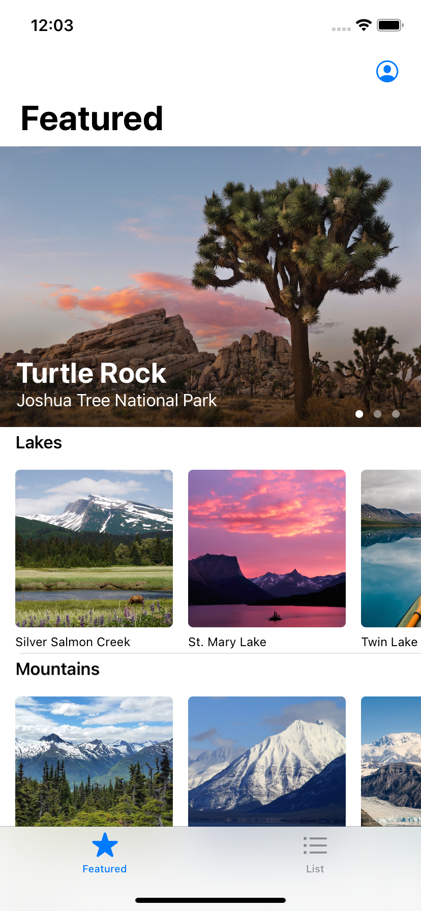

# Learning SwiftUI

A repository recording my journey of learning SwiftUI.

I followed the [official SwiftUI Tutorial](https://developer.apple.com/tutorials/swiftui) from Apple.

### Landmark Application
A application about landmark was made throughout the tutorial.

### Different Tabs

### Editing User's Profile

### Adding Favorite Landmarks

### Map Feature

## Chapter 1 SwiftUI Essentials

* Creating and Combining Views

* Building Lists and Navigation

* Handling User Input

## Chapter 2 Drawing and Animation

* Drawing Paths and Shapes

* Animating Views and Transitions

## Chapter 3 App Design and Layout

* Composing Complex Interfaces

* Working with UI Controls

## Chapter 4 Framework Integration

* Interfacing with UIKIT

